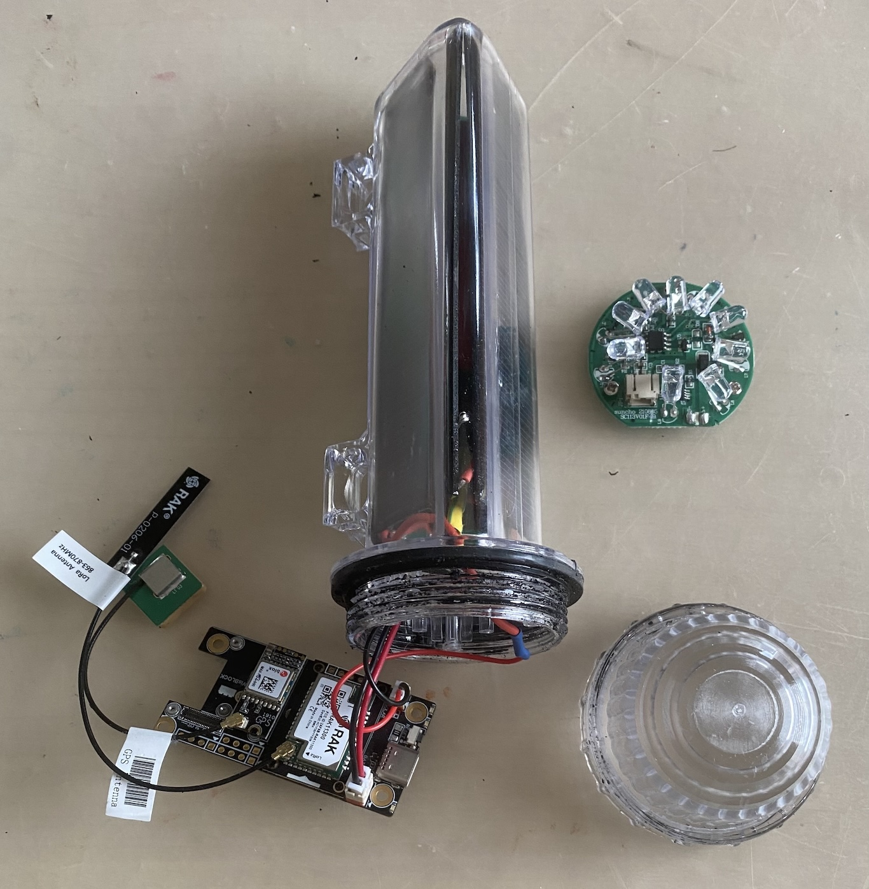

# Meshtastic message for AIS (automatic identification system) 🚢⛵🛶

[AIS](https://en.wikipedia.org/wiki/Automatic_identification_system) enables to a vessel to [report periodically its position](https://www.navcen.uscg.gov/ais-messages).

An affordable AIS solution could be built on Meshtastic nodes embedded in [low-cost buoys](https://www.instructables.com/Meshtastic-Solar-Buoy/), with repeaters deployed along coastlines, other vessels and on [satellites](../leo_repeater/).

References
* https://github.com/aduvenhage/ais-decoder
* https://www.tindie.com/products/astuder/daisy-ais-receiver/
  * https://github.com/astuder/dAISy

